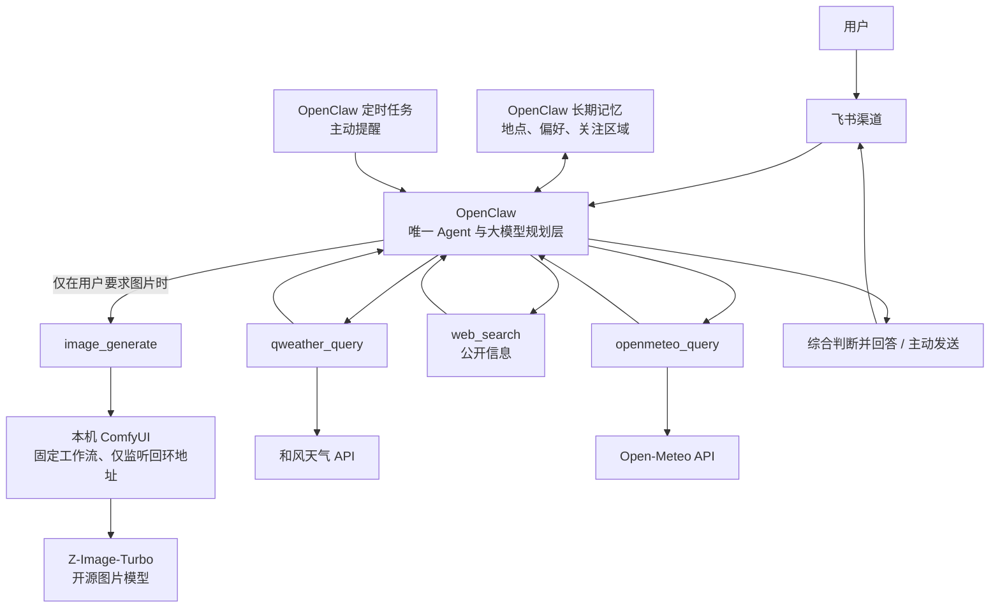

# 架构

## 边界

OpenClaw 是唯一的 Agent 与编排层。这个项目不再维护第二套对话服务、记忆库、任务调度器或飞书事件服务。

固定简报同样由 OpenClaw 原生 cron 执行。仓库中的 `config/automations/` 只保存声明、全国分析指南和提示词，`scripts/setup-automations.ps1` 负责幂等同步；它不是常驻调度服务。默认沿用 V1 的三个有效时间点，但内容升级为 09:00 全国电力交易气象晨报、16:30 全国变化复核、17:00 全国次日预报。全国任务先筛查七大区域，再精查 6～10 个重点省份，不机械罗列全部省份。一次运行只生成一份正文，并通过 OpenClaw 原生 `message` 工具显式发送到全部审核群；cron 的自动投递保持关闭，防止工具调用后的模型收尾文本被误发到某个主群。V1 的 17:05 原本用于关闭社区提交窗口，新架构没有提交和裁判流程，因此不保留该空任务。由于隔离 cron 每次运行使用独立会话，09:00 与 16:30 通过一个被 Git 忽略的当日晨报快照比较变化；该快照是短期运行数据，不写入长期记忆。

长期记忆也不另建服务：`memory-core` 管理 `MEMORY.md` 和每日记忆，本地 llama.cpp Embeddings 提供语义检索，`Active Memory` 只在私聊中自动召回，`Dreaming` 每天按证据整理并晋升稳定事实。这里的“学习”仅限记忆，不会改写代码、工具或配置。

`qweather_query` 和 `openmeteo_query` 只负责：

1. 接收 Agent 给出的地点、时间范围和数据类型；
2. 调用对应供应商 API；
3. 返回供应商原生 JSON、原生地点查询结果和请求时间。

它们不负责标准化、多源融合、可信度打分或生成最终回答。

图片生成是独立的输出能力，不是新的气象源，也不进入多源判断链路。只有用户明确要求图片时，Agent 才调用 `image_generate`。ComfyUI 在本机以固定核心节点工作流运行，不加载第三方节点，也不把提示词或图片提交给云端服务。当前工作流固定输出 `1024×1024` 单图。生成图片只能作为视觉创作，不能冒充雷达、卫星云图、预警图或真实观测证据。

## Agent 选择策略

- 简单问题通常只调用一个最合适的来源。
- 复杂、长期或高影响问题可以调用多个气象源。
- 需要官方公告、灾情、交通影响或最新公共信息时使用 `web_search`。
- 多来源不一致时由 Agent 核对差异并说明必要的不确定性，不把不同口径的数据直接求平均；除非用户明确询问，不主动展示来源名称和更新时间。
- 官方预警优先于模型推断；Agent 不把预报描述成确定事实。

## 多源分析框架

当用户明确询问算法或多来源综合方法时，对外称为“多源气象一致性判别与情景推演框架（Multi-source Weather Consistency & Scenario Reasoning，MWCSR）”。它由 Agent 执行五层推理：

1. 按地点、日期和逐小时时段完成多源时空对齐；
2. 提取温度、体感、降水、云量和风等任务相关特征；
3. 判断变化方向、峰值时段、阈值越界及来源一致性；
4. 对冲突信号保留基准、偏强和偏弱等情景包络，不做简单平均；
5. 沿“气象变化 → 用电负荷与新能源出力 → 净负荷 → 交易风险”因果链推演，并区分判断确定性。

MWCSR 是 Agent 驱动的算法化推理框架，不是独立融合服务，也不代表系统实现了数值天气融合、动态权重学习、负荷回归或电价预测模型。普通回答不主动介绍该框架；仅在用户明确询问时说明。

## 输出呈现

简单问题继续直接回答；普通多时段、多地点或风险分析使用 `workspace/formats/weather-report.md`。三条全国定时简报使用独立的 `workspace/formats/power-weather-report.md`，呈现全国结论、重点省份、关键窗口和天气驱动的电力影响。来源名称与更新时间默认不展示，仅在用户明确询问时补充。为兼容飞书原生 Markdown 卡片，编号重点使用从行首开始的加粗编号，不在 Markdown 有序列表中嵌套加粗。项目不增加前端或自定义卡片渲染层。

## 扩展方式

新增气象源时，在插件中增加一个新的独立工具，例如 `new_source_query`。它与已有工具平级，由 Agent 决定何时调用，不引入公共融合层。
